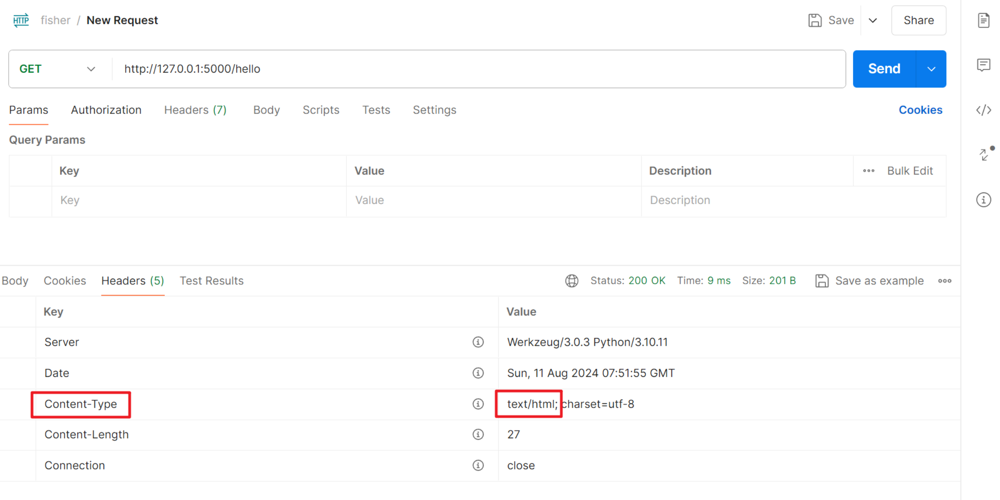

# 1. Flask的基础原理与核心知识

## 1.1 pipenv创建虚拟环境

```cmd
# 安装pipenv
pip install pipenv

# 进入项目文件夹，创建虚拟环境
pipenv install

# 启动虚拟环境
pipenv shell

# 安装依赖
pipenv install xxx

# 卸载依赖
pipenv uninstall xxx

# 查看依赖关系
pipenv graph

# 退出虚拟环境
exit
```

## 1.2 hello world

```py
from flask import Flask

app = Flask(__name__)


@app.route('/hello')
def test():
    return "hello world"


app.run()
```

## 1.3 另一种注册路由的方式

```python
from flask import Flask

app = Flask(__name__)

def test():
    return "hello world"

# 注册蓝图，绑定视图函数
app.add_url_rule('/hello', view_func=test)
# 开启debug模式，修改代码会自动重启服务器
app.run(debug=True)
```

基于类的视图，必须使用`add_url_rule`的方式

## 1.4 app.run相关参数与flask配置文件

根目录创建`config.py`作为配置文件

```py
# 必须全部大写
DEBUG = True
```

使用`app.config.from_object`导入配置文件，然后使用`app.config['DEBUG']`像字典一样使用config中的信息

```py
from flask import Flask

app = Flask(__name__)
# 导入配置文件
app.config.from_object('config')
def test():
    return "hello world"


app.add_url_rule('/hello', view_func=test)
# 取配置文件中的配置
app.run(debug=app.config['DEBUG'])
```

## 1.5. ifmain的作用

```py
from flask import Flask

app = Flask(__name__)
# 导入配置文件
app.config.from_object('config')
def test():
    return "hello world"


app.add_url_rule('/hello', view_func=test)
if __name__ == '__main__':
    app.run(debug=app.config['DEBUG'])
```

常来说`if __name__ == '__main__'`代表着作为入口文件，才会执行app.run。但是为什么要这样呢，因为生产环境中，是使用**nginx+uwsgi**来启动项目的，nginx转发前端的请求给uwsgi，uwsgi作为服务器启动项目。如果仍然执行app.run，使用flask自带的服务器是不可以的。


总结一下，`if __name__ == '__main__'` 的作用是：

1. 在开发环境中，允许直接运行 Flask 应用脚本启动开发服务器。
2. 在生产环境中，防止 Flask 应用脚本被导入时无意中启动 Flask 的内置服务器。

这样，我们就可以根据环境的不同，选择适当的方式启动 Flask 应用。

## 1.6 响应对象Response

视图函数的return和普通函数存在不同，flask框架会在背后进行一些列的封装。

现在让视图函数返回<html><h1>hello</h1></html>

```py
from flask import Flask

app = Flask(__name__)
# 导入配置文件
app.config.from_object('config')


@app.route("/hello")
def test():
    return "<html><h1>hello</h1></html>"


def common_test():
    return "hello world"


if __name__ == '__main__':
    # 开启debug模式，修改代码会自动重启服务器
    app.run(host='0.0.0.0', port=5000, debug=app.config['DEBUG'])
```

前端会将html进行解析后显示在页面，为什么不直接显示字符串呢？

视图函数除了返回字符串之外，还会返回一些附加信息

```py
@app.route("/hello")
def test():
    # status code 200 301 403 404
    # content-type 放置与http headers属性中 告诉接收方如何解析内容
    # 默认情况 content-type指定为text/html 
    return "<html><h1>hello</h1></html>"
```

所以把返回的内容当成html解析了



flask会将字符串当成响应Reponse的主体内容，然后还有Content-type等一系列信息封装成一个对象--`Reponse`，这里使用make_response函数创建response对象

```py
from flask import Flask, make_response

@app.route("/hello")
def test():
    # 当成普通字符串
    headers = {
        'Content-Type': 'text/plain'
    }
    resp = make_response("<html><h1>hello</h1></html>", 404)
    resp.headers = headers
    return resp
```


测试一下301重定向，会重定向到www.baidu.com

```py
@app.route("/hello")
def test():
    # 当成普通字符串
    headers = {
        'content-type': 'text/plain',
        'location': 'http://www.baidu.com'
    }
    resp = make_response("<html><h1>hello</h1></html>", 301)
    resp.headers = headers
    return resp
```


flask不需要自己创建response对象，简写方式如下：

```py
@app.route("/hello")
def test():
    # 当成普通字符串
    headers = {
        'content-type': 'text/plain',
        'location': 'http://www.baidu.com'
    }
    # 返回的是一个元组，flask会将这个元组构造成reponse进行返回
    return '<html><h1>hello</h1></html>', 301, headers
```

这种方式用的最多，也是最方便的